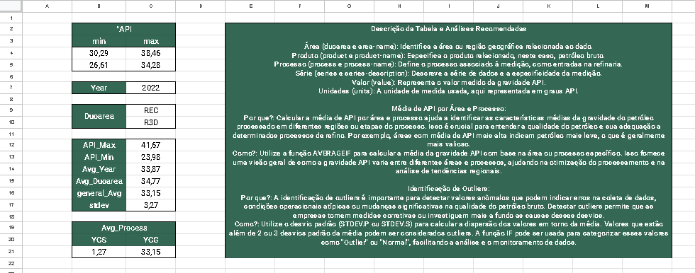
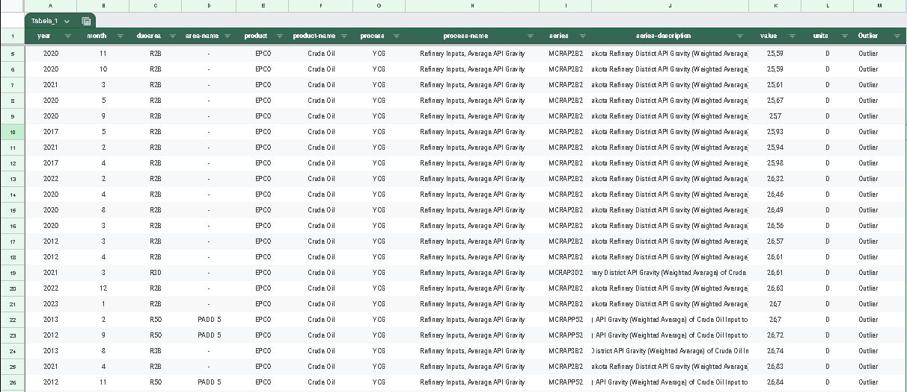

# Oil-data
[link to spreadsheet](https://docs.google.com/spreadsheets/d/1HsxwfeZA4Dh_K_0slyt0xda-1rKfyTE3jxomgv39tUw/edit?usp=sharing)



## Setup env
```sh
cd C:\path\to\your\project
python -m venv myenv
myenv\Scripts\activate 
```
## Install dependencies
```sh
pip install -r requirements.txt
```

## Define your .env

See .env.example and define your .env file.
Get your API key from [EIA](https://www.eia.gov/opendata/).
